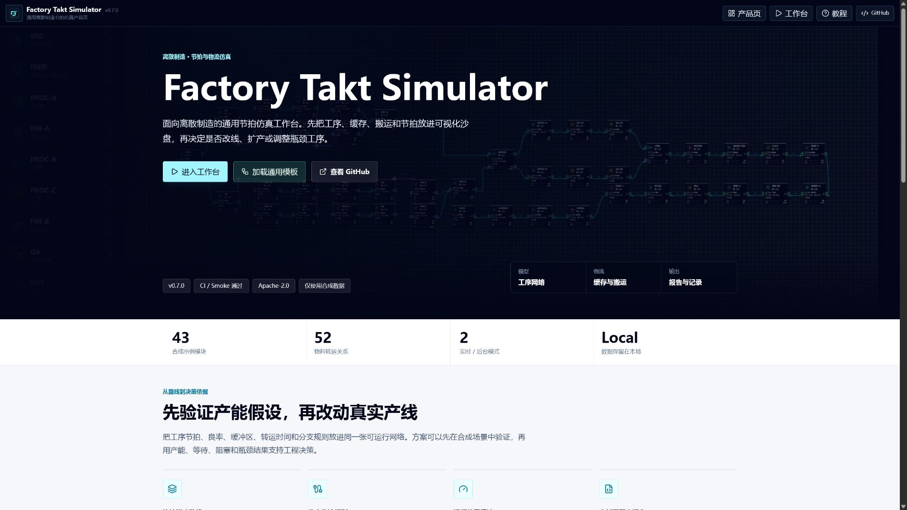
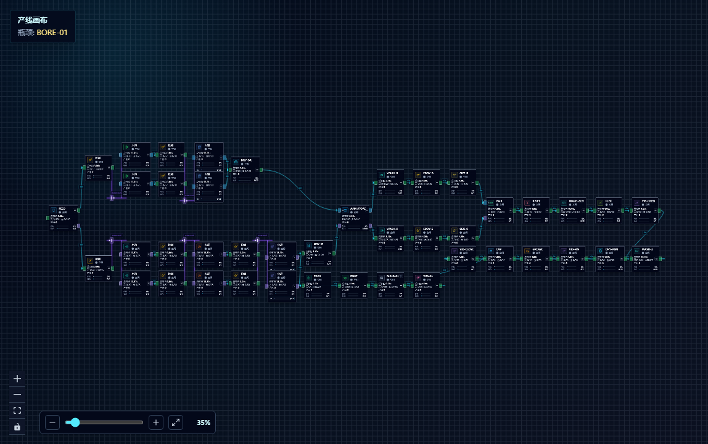
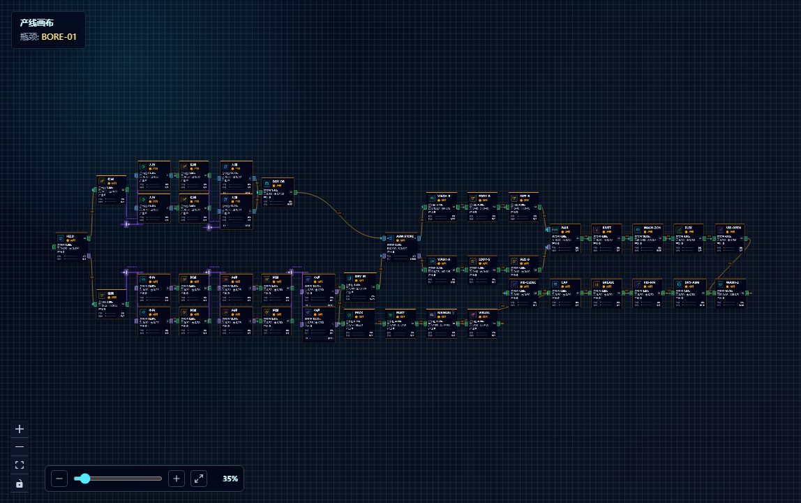
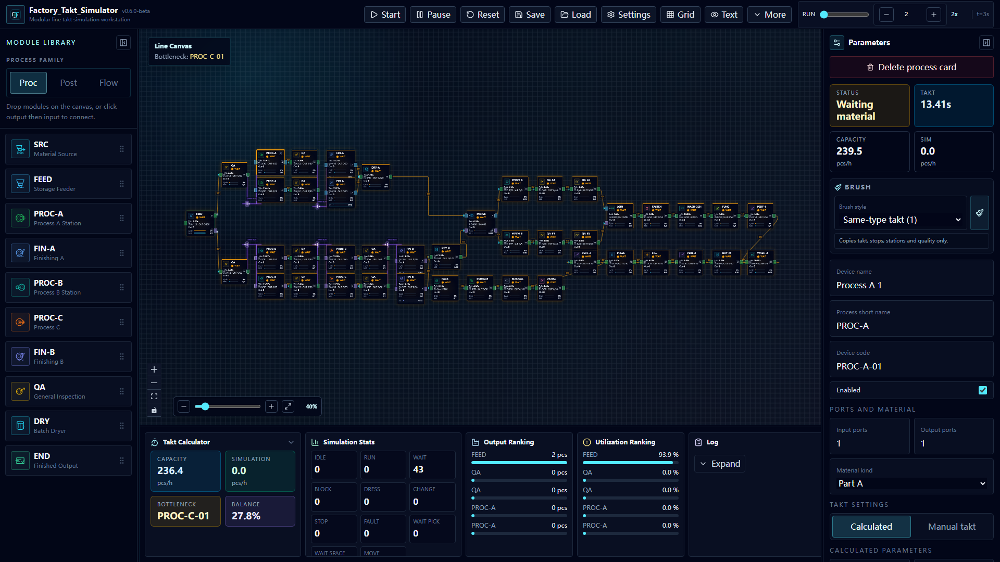
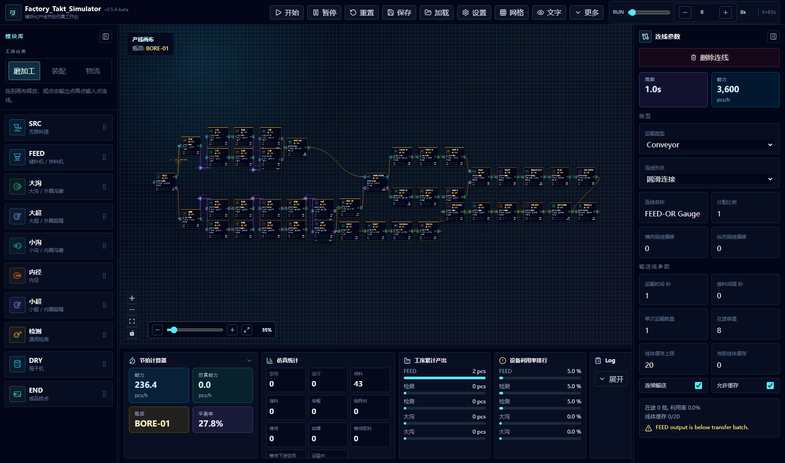
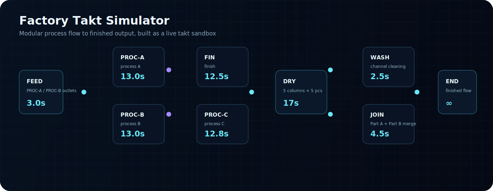
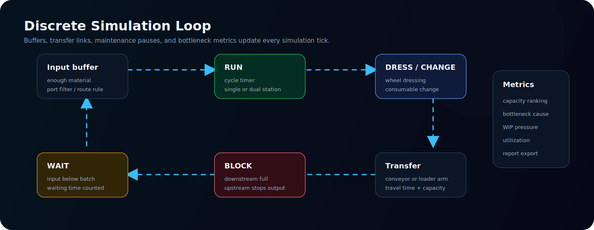
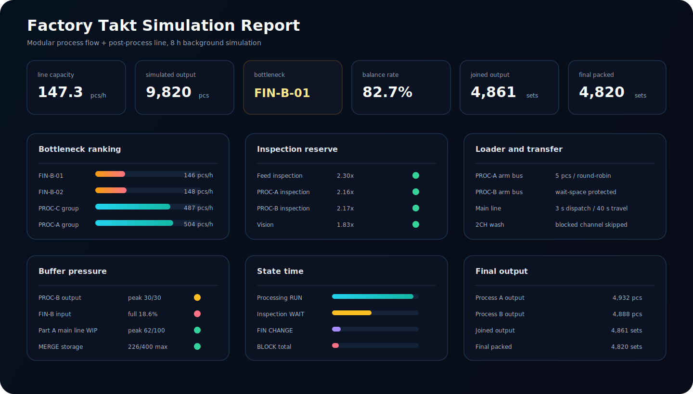

# Factory Takt Simulator

[](https://github.com/Felix-Zuo/factory-takt-simulator/actions/workflows/ci.yml)
[](https://github.com/Felix-Zuo/factory-takt-simulator/actions/workflows/pages.yml)
[](https://github.com/Felix-Zuo/factory-takt-simulator/releases/latest)
[](LICENSE)

Factory Takt Simulator is a visual takt-time and flow-simulation workstation for modular discrete-manufacturing lines. It helps users sketch process routes, tune buffers and transfer rules, run live or background simulation, and export capacity reports without binding the model to one product category.

中文定位：面向离散制造产线的模块化节拍仿真工作台。设备是模块，路线由用户连线决定，系统负责节拍计算、缓存流转、机械手搬运、瓶颈识别和报告输出。

**[Open the live product](https://felix-zuo.github.io/factory-takt-simulator/?view=showcase)** · **[Launch the workbench](https://felix-zuo.github.io/factory-takt-simulator/)** · **[Read the latest release](https://github.com/Felix-Zuo/factory-takt-simulator/releases/latest)**



## What It Models

| Process network | Material flow | Simulation | Decision output |
| --- | --- | --- | --- |
| 43-module synthetic full-line example | 52 transfer routes with buffers and handling rules | Live animation or background target runs | Capacity, utilization, bottlenecks, records, and reports |

The repository uses synthetic scenarios and generic Process A/B/C, Finishing, Merge, Join, QA, and Packing modules. Real customer routes, machine IDs, operator names, production targets, and raw factory files are outside the public data boundary.

## Workbench Tour

| Line sandbox | Running flow |
| --- | --- |
|  |  |

| Process parameters | Transfer settings |
| --- | --- |
|  |  |

## Line Logic



## Simulation Model



## Simulation Report



Full report: [docs/showcase/report-example.md](docs/showcase/report-example.md)

## Core Features

- Drag process modules onto the canvas and connect input/output ports.
- Automatically orient ports for left-to-right and folded return-flow routes.
- Configure conveyors, loader-arm buses, dispatch interval, travel time, batch size, route shape, and line-buffer capacity.
- Model generic source, feeder, Process A/B/C, finishing, QA, merge buffer, wash/dry, join, fasten, fill, press, surface treatment, and packing modules.
- Switch between calculated takt mode and direct single-piece takt mode.
- Track waiting, blocking, maintenance, consumable change, utilization, output, capacity, and line-balance metrics.
- Run live simulation or background simulation by target time / target output.
- Save, load, import, export, and restore scenarios locally.
- Load the synthetic 43-node full-line template from `public/scenarios/modular-line-template.json`.
- Expose a browser-side integration bridge for external tools:

```ts
window.FactoryTaktAgent.getSnapshot()
window.FactoryTaktAgent.runCommand({ type: 'createFullLineExample' })
window.FactoryTaktAgent.runCommand({ type: 'runBackgroundSimulation' })
```

## Showcase History

The public project history is documented in [docs/PROJECT_HISTORY.md](docs/PROJECT_HISTORY.md). It is a sanitized product-evolution record, not a fabricated git history and not a disclosure of any private factory deployment.

## Project Documents

- [Architecture](docs/ARCHITECTURE.md)
- [Design benchmarks](docs/DESIGN_BENCHMARKS.md)
- [Quality model](docs/QUALITY.md)
- [Roadmap](docs/ROADMAP.md)
- [Scenario JSON notes](docs/SCENARIO_SCHEMA.md)
- [Agent integration](docs/AGENT_INTEGRATION.md)
- [Contributing](CONTRIBUTING.md)
- [Security policy](SECURITY.md)

## Quick Start

```bash
npm install
npm run dev
```

Desktop preview:

```bash
npm run desktop
```

Windows portable build:

```bash
npm run dist:win
```

## Project Structure

```text
src/
  components/
    canvas/        Canvas, process cards, transfer links, context menu
    layout/        Main panels, settings, tutorial, project overview
    ui/            Reusable controls
  data/            Device catalog and default parameters
  hooks/           Keyboard shortcuts and local scenario memory
  i18n/            Interface text helpers
  lib/             Simulation, takt calculation, analysis, reports, bridge
  store/           Application state
  types/           Shared domain types
electron/          Desktop shell
examples/          Synthetic scenario examples
docs/              Showcase assets, integration notes, packaging notes
```

## Verification

```bash
npm run build
npm run lint
npm run maintain:check
npm audit --omit=dev
npm run test:smoke
```

## License

Apache-2.0
