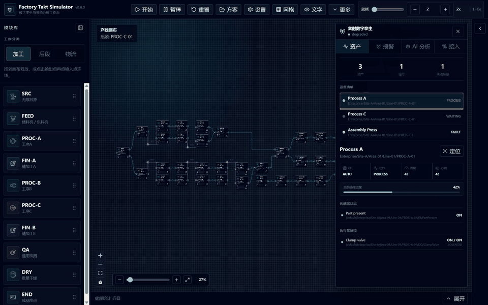

# Factory Takt Simulator

[](https://github.com/Felix-Zuo/factory-takt-simulator/actions/workflows/ci.yml)
[](https://github.com/Felix-Zuo/factory-takt-simulator/actions/workflows/pages.yml)
[](https://github.com/Felix-Zuo/factory-takt-simulator/releases/latest)
[](LICENSE)

Factory Takt Simulator is a local-first production-line simulator and industrial digital-twin workbench for modular discrete manufacturing. It combines deterministic takt and material-flow simulation with a bounded, read-only live-state contract for PLC, sensor, actuator, alarm, and MES context.

中文定位：面向离散制造产线的节拍仿真与工业数字孪生工作台。设备与工序保持通用化，既可用合成场景验证节拍、缓存和搬运逻辑，也可通过本地网关只读映射机床动作、传感器、电磁阀、PLC 模式和报警。

**[Open the live product](https://felix-zuo.github.io/factory-takt-simulator/?view=showcase)** · **[Launch the workbench](https://felix-zuo.github.io/factory-takt-simulator/)** · **[Read the latest release](https://github.com/Felix-Zuo/factory-takt-simulator/releases/latest)**



## What It Models

| Process network | Industrial state | Integration boundary | Decision support |
| --- | --- | --- | --- |
| 43-module synthetic full-line example and 52 transfer routes | PLC mode, machine action, sensor quality, actuator command/feedback, and alarms | Ignition/Sepasoft reference preset, OPC UA or Sparkplug B at the edge, normalized HTTPS/SSE in the app | Capacity, utilization, bottlenecks, reports, and bounded engineering analysis |

The repository uses synthetic scenarios and generic Process A/B/C, Finishing, Merge, Join, QA, and Packing modules. Real customer routes, machine IDs, operator names, production targets, and raw factory files are outside the public data boundary.

## Industrial Twin Boundary

The bundled gateway is a reference adapter, not a commissioned MES or a safety system. The recommended plant-side stack is Ignition 8.3 plus optional Sepasoft MES, with approved PLC values exposed through OPC UA or MQTT Sparkplug B. Browser code never connects directly to a PLC.

- `POST /api/industrial/events` accepts a bounded normalized snapshot behind an ingest token.
- `GET /api/industrial/stream` publishes validated snapshots to the canvas over SSE.
- Alarms are read-only in the public UI.
- Real command execution is disabled by default and separated from preview, authentication, confirmation, interlocks, and downstream audit.
- DeepSeek V4 Flash is optional, server-side only, rate- and token-limited, and has no PLC tool.

See [Industrial integration](docs/INDUSTRIAL_INTEGRATION.md) and [AI assistant policy](docs/AI_ASSISTANT.md).

## Workbench Tour

| Line sandbox | Running flow |
| --- | --- |
|  |  |

| Process parameters | Transfer settings |
| --- | --- |
|  |  |

## Line Logic


## Simulation Model


## Simulation Report


Full report: [docs/showcase/report-example.md](docs/showcase/report-example.md)

## Core Features

- Drag process modules onto the canvas and connect input/output ports.
- Automatically orient ports for left-to-right and folded return-flow routes.
- Configure conveyors, loader-arm buses, dispatch interval, travel time, batch size, route shape, and line-buffer capacity.
- Model generic source, feeder, Process A/B/C, finishing, QA, merge buffer, wash/dry, join, fasten, fill, press, surface treatment, and packing modules.
- Switch between calculated takt mode and direct single-piece takt mode.
- Track waiting, blocking, maintenance, consumable change, utilization, output, capacity, and line-balance metrics.
- Run live simulation or background simulation by target time / target output.
- Switch between a deterministic synthetic twin and a normalized live gateway feed.
- Inspect machine actions, PLC state, sensor quality, actuator command/feedback mismatches, and active alarms beside the canvas.
- Ask a bounded engineering assistant to analyze or teach from the current report, with local zero-cost fallback and explicit approval for simulator-only actions.
- Save, load, import, export, and restore scenarios locally.
- Load the synthetic 43-node full-line template from `public/scenarios/modular-line-template.json`.
- Expose a browser-side integration bridge for external tools:

```ts
window.FactoryTaktAgent.getSnapshot()
window.FactoryTaktAgent.runCommand({ type: 'createFullLineExample' })
window.FactoryTaktAgent.runCommand({ type: 'runBackgroundSimulation' })
window.FactoryTaktAgent.runCommand({ type: 'openTwinConsole', tab: 'alarms' })
```

## Showcase History

The public project history is documented in [docs/PROJECT_HISTORY.md](docs/PROJECT_HISTORY.md). It is a sanitized product-evolution record, not a fabricated git history and not a disclosure of any private factory deployment.

## Project Documents

- [Architecture](docs/ARCHITECTURE.md)
- [Design benchmarks](docs/DESIGN_BENCHMARKS.md)
- [Quality model](docs/QUALITY.md)
- [Roadmap](docs/ROADMAP.md)
- [Scenario JSON notes](docs/SCENARIO_SCHEMA.md)
- [Agent integration](docs/AGENT_INTEGRATION.md)
- [Industrial integration](docs/INDUSTRIAL_INTEGRATION.md)
- [Bounded AI assistant](docs/AI_ASSISTANT.md)
- [Contributing](CONTRIBUTING.md)
- [Security policy](SECURITY.md)

## Quick Start

```bash
npm install
npm run dev
```

Optional local industrial gateway:

```bash
cp .env.example .env.local
npm run gateway
```

On Windows PowerShell, use `Copy-Item .env.example .env.local`. Keep API keys and plant tokens in `.env.local`; it is ignored by Git.

Desktop preview:

```bash
npm run desktop
```

Windows portable build:

```bash
npm run dist:win
```

## Project Structure

```text
src/
  components/
    canvas/        Canvas, process cards, transfer links, context menu
    layout/        Main panels, settings, tutorial, project overview
    ui/            Reusable controls
  data/            Device catalog and default parameters
  hooks/           Keyboard shortcuts and local scenario memory
  i18n/            Interface text helpers
  lib/             Simulation, takt calculation, analysis, reports, bridge
  lib/industrial/  Twin demo mapping, gateway client, local assistant
  store/           Simulation and industrial twin state
  types/           Simulation and industrial contracts
server/             Bounded local gateway, SSE, command preview, AI policy
integration/        Ignition/Sepasoft and Sparkplug presets plus example events
electron/          Desktop shell
examples/          Synthetic scenario examples
docs/              Showcase assets, integration notes, packaging notes
```

## Verification

```bash
npm run build
npm run lint
npm run test:gateway
npm run maintain:check
npm audit --omit=dev
npm run test:smoke
```

## License

Apache-2.0
