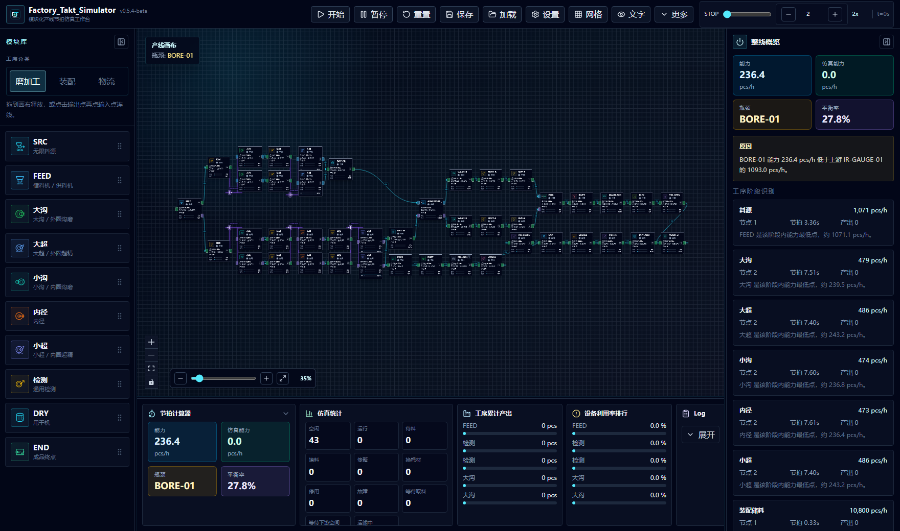

# Factory Takt Simulator

Factory Takt Simulator is a visual production-line takt sandbox for building process routes, tuning buffers and transfer rules, running discrete simulation, and exporting capacity reports.

中文定位：面向轴承产线的模块化节拍仿真沙盘。设备是模块，路线由用户连线决定，系统负责节拍计算、缓存流转、机械手搬运、瓶颈识别和报告输出。

Public scenarios are synthetic examples for simulation and portfolio review.
Do not commit real production routes, customer programs, machine parameters, or
factory files unless they have been intentionally sanitized.



## Visual Workbench

| Line sandbox | Running flow |
| --- | --- |
|  |  |

| Process parameters | Transfer settings |
| --- | --- |
|  |  |

## Line Logic


## Simulation Model


## Simulation Report


Full report: [docs/showcase/report-example.md](docs/showcase/report-example.md)

## Core Features

- Drag process modules onto the canvas and connect input/output ports.
- Configure conveyors, loader-arm buses, travel time, batch size, route shape, and buffer capacity.
- Model OR / IR grinding, superfinishing, bore grinding, drying, assembly storage, washing, inspection, pairing, riveting, vibration check, grease filling, cap pressing, rust prevention, and final packing.
- Switch between detailed takt calculation and direct single-piece takt mode.
- Count waiting, blocking, maintenance, consumable-change, utilization, output, and line balance metrics.
- Run live simulation or background simulation by time / target output.
- Save, load, import, export, and restore scenarios locally.
- Expose a browser-side integration bridge for external tools:

```ts
window.FactoryTaktAgent.getSnapshot()
window.FactoryTaktAgent.runCommand({ type: 'createFullLineExample' })
window.FactoryTaktAgent.runCommand({ type: 'runBackgroundSimulation' })
```

## Quick Start

```bash
npm install
npm run dev
```

Desktop preview:

```bash
npm run desktop
```

Windows portable build:

```bash
npm run dist:win
```

## Project Structure

```text
src/
  components/
    canvas/        Canvas, process cards, transfer links, context menu
    layout/        Main panels, settings, tutorial, project overview
    ui/            Reusable controls
  data/            Device catalog and default parameters
  hooks/           Keyboard shortcuts and local scenario memory
  i18n/            Interface text helpers
  lib/             Simulation, takt calculation, analysis, reports, bridge
  store/           Application state
  types/           Shared domain types
electron/          Desktop shell
examples/          Scenario examples
docs/              Showcase assets, integration notes, packaging notes
```

## Verification

```bash
npm run build
npm run lint
npm run maintain:check
```

## License

Apache-2.0
